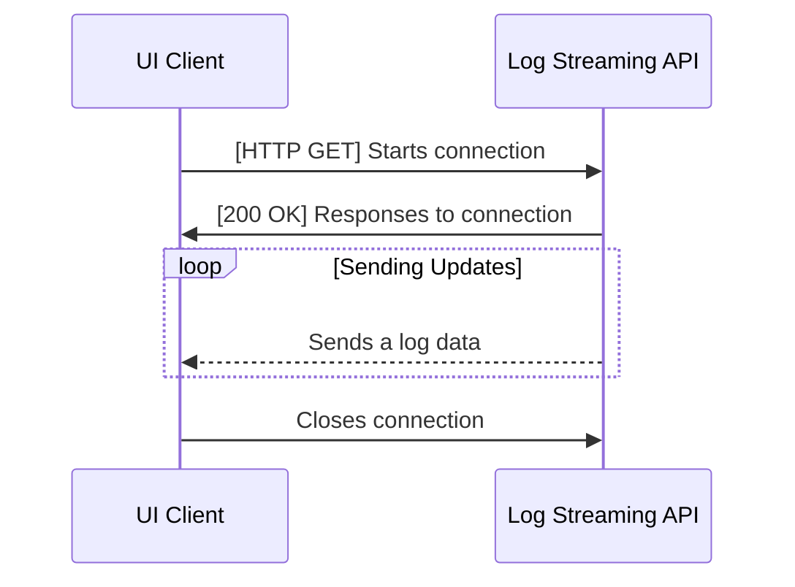

In the digital landscape, where the pace of information flow never slows down, having access to real-time data can set you apart. Whether it's tracking stock prices, monitoring social media updates, or keeping an eye on smart home devices, the need for instant data delivery is more pressing than ever. But, how do we ensure this stream of live data doesn't overwhelm our systems or delay user interactions?

That's where streaming APIs become our heroes, paving the way for efficient, real-time data communication. My journey into the realm of streaming APIs started with a curious question from a friend, sparking my interest to explore how they enable this seamless flow of information. [Here's](https://kungfux.github.io/posts/streaming-api-and-how-to-test-it/){:target="_blank"} his article if it's interesting.

In this guide, we'll uncover the essence of streaming APIs, their significance in the modern web, and how they can be integrated into your projects for dynamic, up-to-the-second data updates.

## Understanding Streaming APIs

Streaming APIs allow for real-time data transmission directly from the source to the application using it. This differs from traditional APIs, which typically operate on a request-response model. With streaming APIs, data flows continuously, eliminating the need for repetitive client requests.

### Types of Streaming APIs

There are several types of streaming APIs:

- **[HTTP Streaming](https://www.pubnub.com/guides/http-streaming/){:target="_blank"}**: Keeps an HTTP connection open for each client. Data is sent as soon as it becomes available, enabling real-time information updates.
- **[WebSockets](https://www.pubnub.com/guides/websockets/){:target="_blank"}**: An advanced technology compared to HTTP streaming, providing full-duplex communication channels over a single TCP connection, allowing for more interactive client-server interactions.
- **[Server-Sent Events (SSE)](https://www.pubnub.com/guides/server-sent-events/){:target="_blank"}**: A standard describing how servers can initiate data transmission to browser clients after establishing an initial connection. It's simpler than WebSockets but only supports server-to-client data flow.
- **[MQTT (Message Queuing Telemetry Transport)](https://www.pubnub.com/guides/mqtt/){:target="_blank"}**: A lightweight messaging protocol for small sensors and mobile devices, optimized for high-latency or unreliable networks.
- and so on

For this example, I've chosen to focus on the SSE standard.

### Implementing a Streaming API Service with SSE

To showcase how to create a Streaming API service with SSE, let's tackle this project: Our goal is to build a service that delivers data, recorded in a log file, back to our client.

Here's how the client-server interaction will unfold:


### Implementing Streaming in Your Projects

In this guide, we’re not going to cover the basics of starting a NestJS project. You can find that info in the [official documentation](https://docs.nestjs.com/first-steps){:target="_blank"}.

Instead, we’ll dive straight into creating a controller and service for our project. To make a controller, you can use either of these commands:

```shell
nest generate controller log-streaming
```
<div align="center">OR</div>
```shell
npx @nestjs/cli generate controller log-streaming
```

Here's a source code of `LogStreamingController`:

```ts
@Controller('logs')
export class LogStreamingController {
	constructor(private readonly _logStreamingService: LogStreamingService) {}

	@Get('stream')	
	streamLogs(@Res() response: Response): void {
		this._logStreamingService.watchLogFile(response);	
	}
}
```

The controller’s job is to manage the streaming of log data to our clients, utilizing our Log Streaming Service to send updates from a log file in real-time.

For setting up the service, the commands are:

```shell
nest generate service log-streaming
```
<div align="center">OR</div>
```shell
npx @nestjs/cli generate service log-streaming
```

Here's a source code of `LogStreamingService`:

```ts
@Injectable({ scope: Scope.REQUEST })
export class LogStreamingService {
	private readonly LOG_FILE_PATH = path.resolve(
		`logs/${new Date().toISOString().slice(0, 10)}.log`,
	);
	private lastFileSize = 0;

	public watchLogFile(clientResponse: Response): void {
		const streamUuid = uuid.v4();
		const watcher = chokidar.watch(this.LOG_FILE_PATH, { persistent: true });

		clientResponse.writeHead(200, {
			'Access-Control-Allow-Origin': '*',
			'Cache-Control': 'no-cache',
			Connection: 'keep-alive',
			'Content-Type': 'text/event-stream',
		});

		this.updateLastFileSize();
		
		watcher.on('change', () => {
			const currentSize = fs.statSync(this.LOG_FILE_PATH).size;
			if (currentSize > this.lastFileSize) {
				const fd = fs.openSync(this.LOG_FILE_PATH, 'r');
				const buffer = Buffer.alloc(currentSize - this.lastFileSize);
				fs.readSync(fd, buffer, 0, buffer.length, this.lastFileSize);
				// The format of our response should be "id: [id]\nevent: <event-type>\ndata: <some-data>\n"
				clientResponse.write(
					`id: ${streamUuid}\nevent: message\ndata: ${buffer.toString()}\n`,
				);
				fs.closeSync(fd);
				this.lastFileSize = currentSize;
			}
		});

		clientResponse.on('close', () => {
			console.log('Client disconnected. Stopping file watch.');
			watcher.close();
		});
	}

	private updateLastFileSize(): void {
		this.lastFileSize = fs.statSync(this.LOG_FILE_PATH).size;
	}
}
```

This service watches a log file for any new data and streams these updates live to the client. It keeps an eye on the file size for any changes, indicating new log entries, and streams these new entries to the client.

We also have a bit of code that creates log data to see our streaming in action. This code writes random log messages into a file, which are then streamed live to the client. This is done using a simple Node.js script that adds new log entries to our file periodically.

```js
const fs = require('node:fs/promises');
const path = require('node:path');

const LOG_DIRECTORY_PATH = path.resolve('../log-streaming-sample/logs');
const USERS = [
	'Dave Toy',
	'Wayne Schmeler',
	'Rodolfo Schiller',
	'Jackie Labadie',
];

const OPERATIONS = ['ADD', 'GET', 'WRITE', 'UPDATE', 'READ', 'DELETE'];

const delay = (ms) => new Promise((resolve) => setTimeout(resolve, ms));

const generateLogMessage = () => {
	const user = USERS[Math.floor(Math.random() * USERS.length)];
	const operation = OPERATIONS[Math.floor(Math.random() * OPERATIONS.length)];
	
	return `[Service #${Math.floor(Math.random() * 100)}] > ${user} did "${operation}" operation.\n`;
};

const getLogFilePath = () => {
	const logFileName = `${new Date().toISOString().slice(0, 10)}.log`;
	
	return path.join(LOG_DIRECTORY_PATH, logFileName);
};

const appendLog = async (logPath, message) => {
	await fs.appendFile(logPath, message, { encoding: 'utf8' });
};

const main = async () => {
	const logPath = getLogFilePath();

	try {
		await fs.access(logPath);
	} catch {
		await appendLog(logPath, '');
	}

	while (true) {
		const logMessage = generateLogMessage();
		await appendLog(logPath, logMessage);
		await delay(1000);
	}
};

main().catch(console.error);
```

After running our log-generating script and our NestJS app, and by going to `https://localhost:3000/logs/stream` in your browser, you’ll see live log data streaming. This shows how Streaming APIs can be used in real scenarios.


## Integrating SSE with React

In this part, we're going to show you how to handle live data from a Streaming API on the client side, using React. We'll build a simple component that shows logs on the webpage. Here’s how I do it:

```tsx
const App = () => {
	const [logs, setLogs] = useState<string[]>([]);

	const handleMessage = useCallback((event: MessageEvent) => {
		setLogs((prevLogs) => [...prevLogs, event.data]);	
	}, []);

	useEventSource("http://localhost:3000/logs/stream", {
		onMessage: handleMessage,
	});

	return (
		<div className="log-list-container">
			<h2 className="log-list-header">Log Messages</h2>
			{logs.length > 0 ? (
				<ul className="log-list">
					{logs.map((log, index) => (
						<li key={index} className="log-item">
							<span className="log-message">{log}</span>
						</li>
					))}
				</ul>
			) : (
				<div>No logs yet.</div>
			)}
		</div>
	);
};
```

We start by setting up our component to hold the logs in its state. Then, we use a special hook to connect to our Streaming API and update our state whenever new log data comes in. This way, our component always shows the latest logs.

For the technical bit, we use the `useEventSource` hook. This connects to the Streaming API, listens for new data, and handles any errors or issues that might come up.

```ts
interface UseEventSourceOptions {
	onOpen?: (ev: Event) => void;
	onMessage: (ev: MessageEvent) => void;
	onError?: (ev: Event | MessageEvent) => void;
}

export const useEventSource = (
	url: string,
	{ onOpen, onMessage, onError }: UseEventSourceOptions
): void => {
	useEffect(() => {
		const eventSource = new EventSource(url);
		
		if (onOpen) eventSource.onopen = onOpen;
		
		eventSource.onmessage = onMessage;
		
		eventSource.onerror = (event) => {
			console.error("EventSource error:", event);
			onError?.(event);
			eventSource.close();
		};

		return () => {
			eventSource.close();
		};
	}, [url, onOpen, onMessage, onError]);
};
```

With this setup, we create a user interface that dynamically updates with new log messages. It's a great example of how React and Streaming APIs can work together to provide real-time data in an app.

Once everything is running, you should see log messages appear on your page in real time, demonstrating the power of streaming data directly into your React app's user interface.


## Conclusion

Streaming APIs offer a fresh perspective on API development, significantly cutting down on network traffic and server load by removing the need for complex client-side implementations.

This method not only enhances the performance of real-time apps but also ensures that users receive timely and relevant information seamlessly. It’s an effective way to scale and improve the user experience across the board.

Thanks for taking the time to read through this guide. Don’t forget to check out the [repository](https://github.com/MrMurdock11/log-streaming-sample){:target="_blank"} I’ve set up as a practical example. If you’ve got questions or experiences you’d like to share, the comments section is the perfect place for us to chat 👇. Enjoyed the article? A like ❤️ and a share 📢 would mean a lot!
